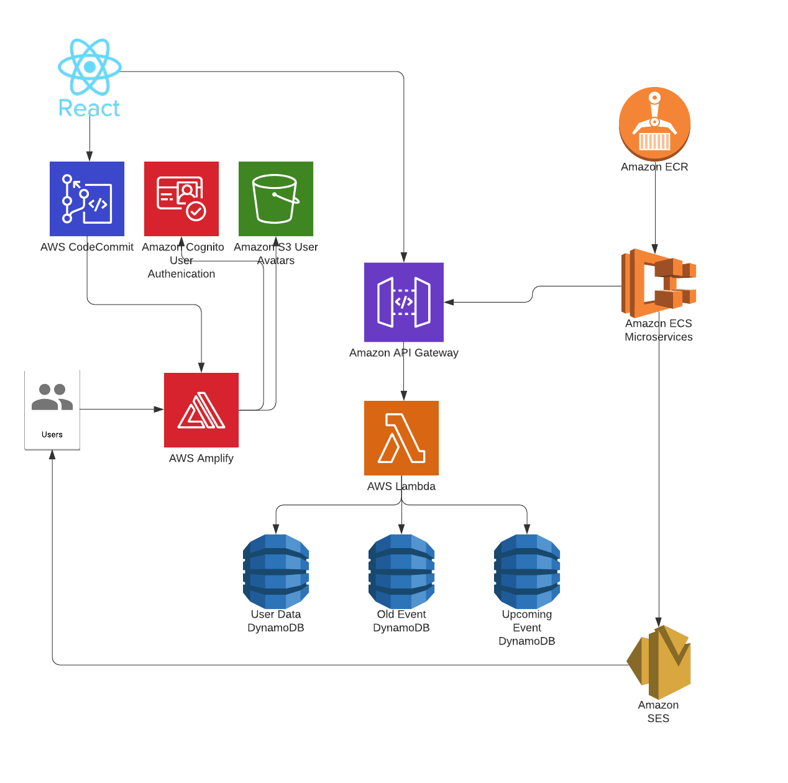

# CRM App For Volunteers (Platinum Volunteers)

This application allows people looking for volunteers to post open positions, and peeople looking to volunteer can see available positions and sign up.

This app is written in React and uses Amplify, Amazon EC2, Amazon Cognito, Amazon DynamoDB, Amazon S3 and API Gateway.

## Architecture Overview



## Prerequisites
+ [AWS Account](https://aws.amazon.com/mobile/details/)
+ [AWS CLI](https://aws.amazon.com/cli/)
+ [NodeJS](https://nodejs.org/en/download/) with [NPM](https://docs.npmjs.com/getting-started/installing-node)

## Getting Started

1. Clone this repo locally.

```
git clone https://github.com/azrielb1/Platinum-Volunteers.git
```

